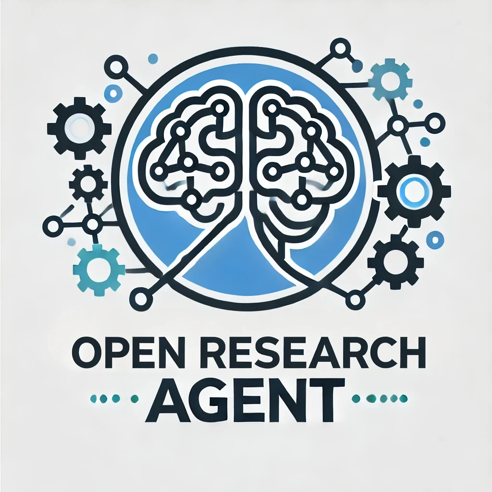

# Open Research Agent

A self-directed, adaptive framework that analyzes published research, synthesizes novel approaches, and implements them through code development and experimentation.

Open Research Agent is an ambitious project aimed at revolutionizing the way we approach scientific research and development. By leveraging the power of artificial intelligence and machine learning, this framework autonomously navigates through vast amounts of published research, identifies promising avenues for innovation, and brings new ideas to life through code implementation and rigorous testing.

### Key Features

- **Intelligent Research Analysis**: Automatically scans and comprehends scientific papers across various domains.
- **Novel Concept Synthesis**: Combines insights from multiple sources to generate original research ideas.
- **Automated Code Generation**: Translates theoretical concepts into practical, testable code.
- **Continuous Learning**: Evolves its knowledge base and capabilities based on new findings and feedback.
- **Interdisciplinary Approach**: Facilitates cross-pollination of ideas between different fields of study.

### Why Open Research Agent?

In an era of information overload, keeping up with the latest research and identifying truly groundbreaking opportunities can be overwhelming. Open Research Agent aims to accelerate scientific progress by:

1. Reducing the time researchers spend on literature review.
2. Uncovering non-obvious connections between disparate fields.
3. Rapidly prototyping and testing new ideas.
4. Democratizing access to cutting-edge research and development capabilities.

### Getting Started

### How to Contribute

We welcome contributions from researchers, developers, and enthusiasts alike. Whether you're interested in improving our natural language processing capabilities, enhancing our code generation algorithms, or expanding our knowledge base, there's a place for you in this project.

### Community and Support

- Join our [Slack Channel](https://join.slack.com/t/openresearchagent/shared_invite/zt-2m9v3aqzo-3CJyVNP4i3WEAgB3tf6ajg) for discussions and support.
- Follow us on [Twitter](https://x.com/ShihongLiu123) for project updates.

### License

- This project is licensed under the MIT License - see the [LICENSE](LICENSE) file for details.
---

Open Research Agent is more than just a tool; it's a vision for the future of scientific discovery. Join us in pushing the boundaries of what's possible in research and development!
